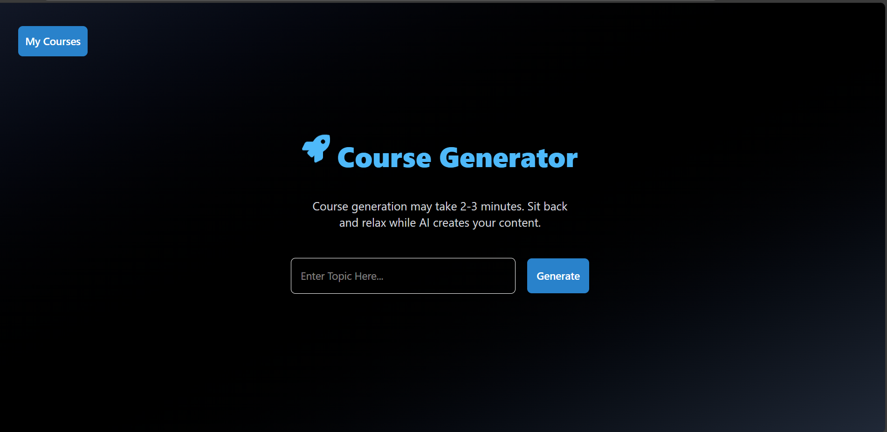
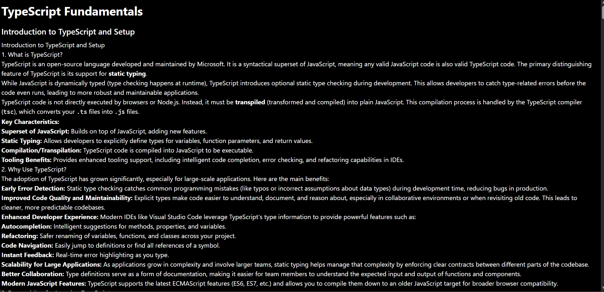
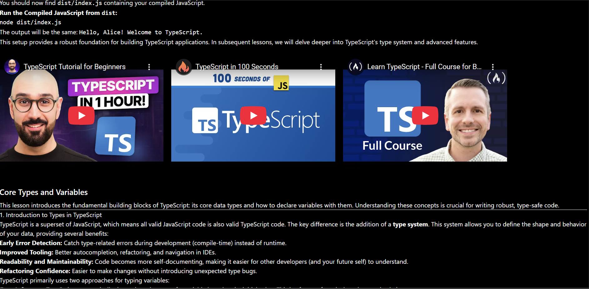
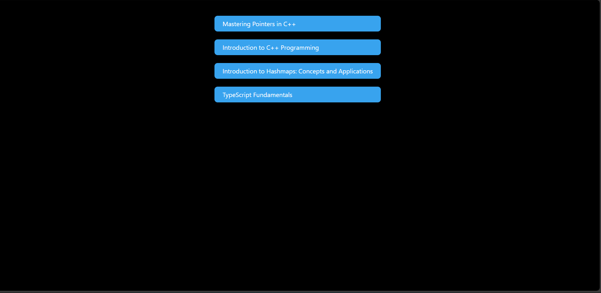

# 🎓 AI Course Builder

An AI-powered course generation platform built with **React**, **Node.js**, **MongoDB**, **TailwindCSS**, and **Gemini API**.  
This app allows users to generate personalized mini-courses instantly — each course contains AI-generated lessons and curated YouTube videos related to the topic.

---

## 🚀 Features

- 🤖 **AI-Powered Course Generation**  
  Uses the **Gemini API** to generate 3 structured lessons for any topic entered by the user.

- 🎥 **YouTube Video Integration**  
  Each lesson automatically fetches **3 relevant YouTube videos** using the **YouTube Data API**.

- 🔐 **Authentication System**  
  Secure user authentication and session management with **JWT** and **HTTP-only cookies**.

- 🧠 **Dynamic & Personalized Learning**  
  Each user can create unique courses based on any topic or field of interest.

- 💾 **Database Storage**  
  Courses and user data are stored in **MongoDB**, ensuring persistence across sessions.

- 🎨 **Modern UI/UX**  
  Responsive and clean design built using **TailwindCSS**.

---

## 🛠️ Tech Stack

**Frontend:**  
- React.js  
- TailwindCSS  
- Axios  

**Backend:**  
- Node.js  
- Express.js  
- MongoDB + Mongoose  
- JWT (JSON Web Token) for authentication  

**APIs:**  
- Gemini API (for AI-generated lessons)  
- YouTube Data API (for fetching relevant videos)  

---
## 🧩 How It Works

1. 🔐 **User Authentication** — The user logs in or signs up securely using **JWT-based authentication**.
2. ✍️ **Prompt Input** — The user types a topic prompt, for example:  
   > "Learn the basics of Machine Learning"
3. 🤖 **AI Lesson Generation** — The app uses the **Gemini API** to dynamically generate **3 lessons** related to the topic.
4. 🎥 **YouTube Integration** — For each lesson, the app fetches **3 relevant YouTube videos** using the **YouTube Data API**.
5. 📚 **Interactive Learning** — The user can explore the generated lessons and watch the videos directly within the app’s clean, responsive interface.
---
## 🖼️ Screenshots

### 🏠 Home Page

### 📚 Generated Course Page

  
  

### 📂 My Courses Page

### 🔐 Login Page

